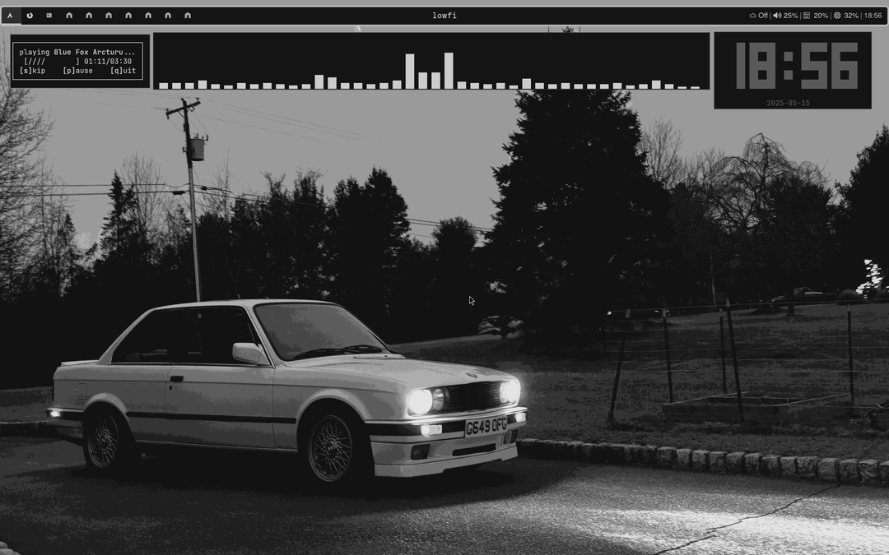

# Arch Linux Rice

A minimal and aesthetic rice setup for **Arch Linux** using **BSPWM**.

---

## System

- **OS**: Arch Linux  
- **WM**: BSPWM  



---

## Software

- [lowfi](https://github.com/talwat/lowfi) – minimal TUI music player  
- [cava](https://github.com/karlstav/cava) – console-based audio visualizer  
- [terminal-rain](https://github.com/rmaake1/terminal-rain-lightning) – matrix rain in the terminal  
- [tty-clock](https://github.com/xorg62/tty-clock) – terminal digital clock  
- [nitch](https://github.com/ssleert/nitch) – system information tool  
- [fastfetch](https://github.com/fastfetch-cli/fastfetch) – fast system info tool  
- [polybar](https://github.com/polybar/polybar) – status bar  
- [rofi](https://github.com/davatorium/rofi) – application launcher  
- [rofi-nordvpn](https://github.com/loiccoyle/rofi-nordvpn) – rofi frontend for NordVPN  
- [kitty](https://github.com/kovidgoyal/kitty) – GPU-based terminal emulator  
- [nitrogen](https://github.com/l3ib/nitrogen) – wallpaper setter  

---

## Fonts

- JetBrains Mono Nerd Font  
- Martian Mono Nerd Font  
- Symbols Nerd Font  

---

## Setup Guide

⚠️WARNING: this setup uses the fr*nch keyboard layout, to change it modify bspwmrc⚠️
To use this rice on a fresh Arch Linux install, follow these steps:

### Use installation script

```bash
wget https://raw.githubusercontent.com/ShadowNetter-Official/Arch-Rice/main/install.sh && sh install.sh
```
### Or install manually:

### 1. Install Required Packages

```bash
sudo pacman -S bspwm sxhkd polybar nitrogen git fastfetch rofi kitty ttf-jetbrains-mono-nerd ttf-martian-mono-nerd ttf-nerd-fonts-symbols lightdm-gtk-greeter brightnessctl pamixer python-pipx
```
### 2. Install YAY (AUR Helper)

```bash
git clone https://aur.archlinux.org/yay-git.git
cd yay-git
makepkg -si
cd ~/
```
### 3. Install Required Packages With YAY

```bash
yay -S cava tty-clock lowfi rofi-nordvpn-git
```

### 4. Clone This Repo

```bash
git clone https://github.com/ShadowNetter-Official/Arch-Rice.git
cd Arch-Rice
```

### 5. Configure BSPWM and Other Tools

```bash
mkdir ~/.config/bspwm
mkdir ~/.config/sxhkd
mkdir ~/.config/rofi
mkdir ~/.config/polybar
mkdir ~/wallpapers
mkdir ~/.config/kitty
cp config/bspwm/bspwmrc ~/.config/bspwm/
cp config/sxhkd/sxhkdrc ~/.config/sxhkd/
cp config/polybar/* ~/.config/polybar/
cp wallpapers/* ~/wallpapers/
cp config/kitty/kitty.conf ~/.config/kitty/
cp config/rofi/config.rasi ~/.config/rofi/
chmod +x ~/.config/bspwm/bspwmrc
chmod +x ~/.config/sxhkd/sxhkdrc
chmod +x ~/.config/polybar/launch.sh
sudo systemctl enable lightdm.service
pipx install git+https://github.com/rmaake1/terminal-rain-lightning.git
pipx ensurepath
wget https://raw.githubusercontent.com/unxsh/nitch/main/setup.sh && sh setup.sh
```

### 6. Done :)

you can now reboot your system

### MIT License

Copyright (c) 2025 ShadowNetter

Permission is hereby granted, free of charge, to any person obtaining a copy
of this software and associated documentation files (the "Software"), to deal
in the Software without restriction, including without limitation the rights
to use, copy, modify, merge, publish, distribute, sublicense, and/or sell
copies of the Software, and to permit persons to whom the Software is
furnished to do so, subject to the following conditions:

The above copyright notice and this permission notice shall be included in all
copies or substantial portions of the Software.

THE SOFTWARE IS PROVIDED "AS IS", WITHOUT WARRANTY OF ANY KIND, EXPRESS OR
IMPLIED, INCLUDING BUT NOT LIMITED TO THE WARRANTIES OF MERCHANTABILITY,
FITNESS FOR A PARTICULAR PURPOSE AND NONINFRINGEMENT. IN NO EVENT SHALL THE
AUTHORS OR COPYRIGHT HOLDERS BE LIABLE FOR ANY CLAIM, DAMAGES OR OTHER
LIABILITY, WHETHER IN AN ACTION OF CONTRACT, TORT OR OTHERWISE, ARISING FROM,
OUT OF OR IN CONNECTION WITH THE SOFTWARE OR THE USE OR OTHER DEALINGS IN THE
SOFTWARE.
